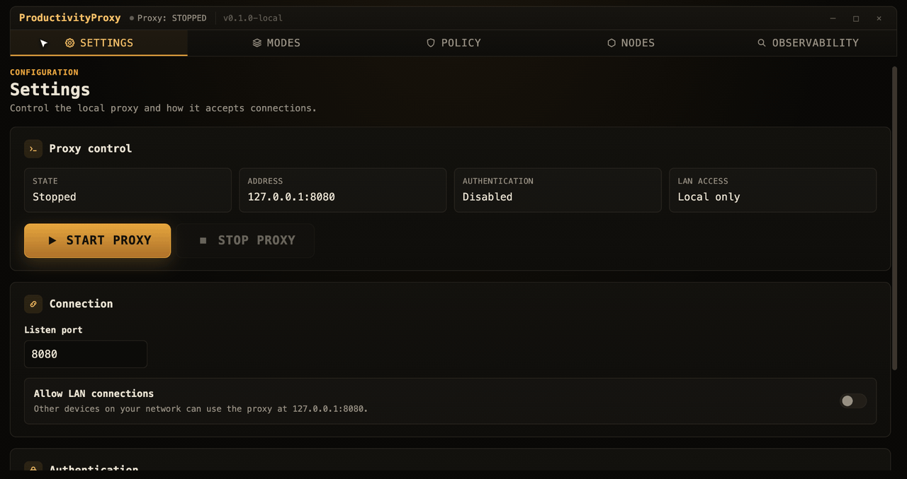
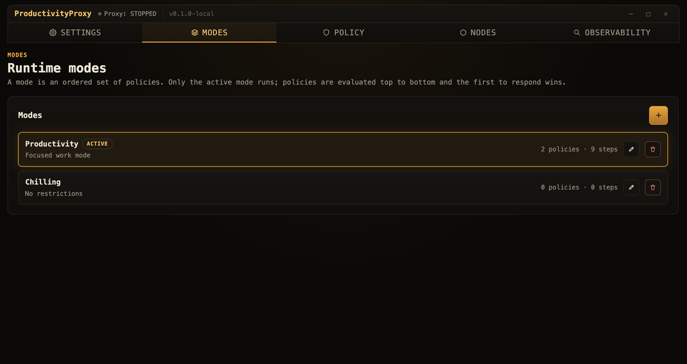
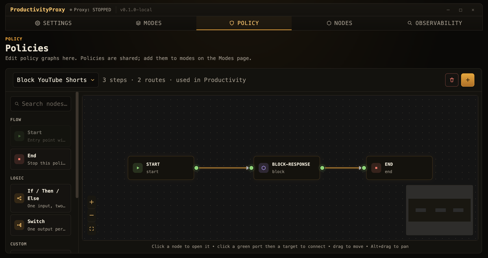
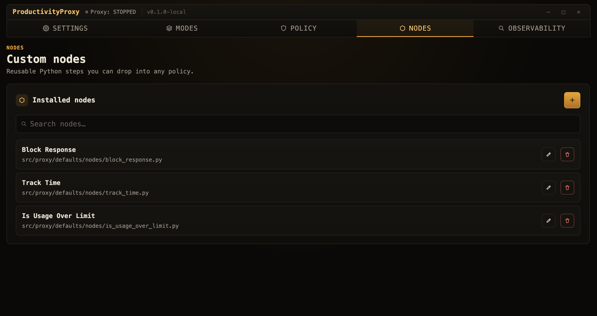

<div align="center">

# ProductivityProxy

### Turn *“just one more video”* into a `403 Forbidden`.

ProductivityProxy is a menu‑bar app that runs a local proxy and enforces **your** rules on **your** traffic — built as visual, node‑based policies. Block YouTube Shorts, put a daily timer on Reddit, or bounce every distraction to a “get back to work” page. No subscriptions, no cloud, no telemetry. It all runs on your machine.



<sub>Building a rule from blocks: name it, set a trigger, drop in an action, configure it.</sub>

</div>

---

## Why it exists

Willpower is a terrible content filter. ProductivityProxy moves the “should I really open this?” decision out of your head and into a tiny program that runs every time a request leaves your browser.

- 🧩 **Visual policies** — wire up `Start → logic → action` graphs on a canvas. No regex soup.
- 🐍 **Real Python under the hood** — every block is a small Python node with full access to the request/response. Bend it however you like.
- 🎛️ **Modes** — flip between *Deep Work*, *Research*, and *Chill* in one click. Each mode is just an ordered set of policies.
- 🔍 **Observability** — a filterable event log shows exactly which policy fired on which request, and why.
- 💻 **Local & private** — a dockless macOS tray app driving `mitmproxy`. Your traffic never leaves the device.

---

## How it works

The mental model is three layers deep:

```
            ┌──────────────────────── Active Mode ────────────────────────┐
 request ──▶│  Policy 1   ▶   Policy 2   ▶   Policy 3   ▶ …  (top‑to‑bottom)│──▶ first match wins
            └──────┬───────────────────────────────────────────────────────┘
                   │  each policy is a graph:
                   ▼
        Start(triggered_by) ─▶ node ─▶ operator ─▶ … ─▶ End
        (run or skip?)       (do/decide)        (stop)
```

- A **Mode** is an *ordered* list of policies. Only the active mode runs.
- A **Policy** is a graph that begins at a **Start** node. The Start node holds Python `def triggered_by(request: Request) -> bool` code — if it returns `False`, the policy is skipped.
- Policies are evaluated top‑to‑bottom and the **first one to produce a response wins** (e.g. a block). If nothing responds, the request passes through.
- An **empty mode = allow everything.** “Chill” is just a mode with no policies.

Building blocks you get out of the box:

| Block | Kind | What it does |
|------|------|--------------|
| **Start** | flow | Entry point + Python trigger (`triggered_by`) |
| **End** | flow | Stops the policy |
| **If / Then / Else** | operator | One input, two branches (Python `if_condition`) |
| **Switch** | operator | One branch per case (Python `switch_condition`) |
| **Block Response** | node | Returns a `403` (or any status) with a message |
| **Track Time** | node | Accumulates active time on a platform |
| **Is Usage Over Limit** | node | Flags when a daily budget is exceeded |
| _your own_ | node | Any Python file with a `run(input, request, context, params)` function |

---

## The dashboard

**Settings** — start/stop the proxy, pick the port, allow LAN devices, optional auth.


**Modes** — your one‑click presets. The active mode glows; everything else is dormant.



**Policy** — the visual editor. Drag blocks from the library onto the canvas and click a node to configure it.



**Nodes** — your library of reusable Python building blocks.



**Observability** — a filterable trace of every request, policy step, and custom‑node log.


---

## Ideas to steal

### Policies

The default library currently registers `Block Response`, `Track Time`, and `Is Usage Over Limit`. Other ideas below may require adding/registering a custom node first.

| Goal | How to build it |
|------|-----------------|
| 🚫 **Kill YouTube Shorts** | `Start` (`triggered_by` checks `youtube.com` + `/shorts`) → `Block Response 403` *(ships by default)* |
| ⏳ **Daily Reddit budget** | `Start` (`triggered_by` checks `reddit.com`) → `Track Time` → `Is Usage Over Limit (30 min)` → `If over` → `Block` *(ships by default)* |
| 🧱 **No social, period** | `Start` (`triggered_by` checks social hosts) → `Block Response` (“Back to work 💪”) |
| 🔔 **Nudge, don’t block** | Add/register a notify node → `Start` (`triggered_by` checks news sites) → `Notify` (“5th time on the news today”) → `End` (let it through) |
| ↪️ **Redirect to a focus page** | Add/register a redirect node → `Start` (`triggered_by` checks distraction hosts) → `Redirect Request` → your “is this aligned with today’s goal?” page |
| 🧠 **Per‑platform limits** | Add/register a detector node → `Detect Platform` → `Switch` (youtube / reddit / twitter) → different budget per case |

### Modes

- **🎯 Deep Work** — *No social* + *Kill Shorts* + *Reddit budget = 0*. The nuclear option.
- **📚 Research** — *No social*, but leave docs, GitHub, and Stack Overflow alone.
- **🌙 Wind Down** — block work email and Slack after 7pm so the evening stays yours.
- **🛋️ Chill** — empty mode. Everything is allowed. Touch grass.

---

## Custom nodes

A node is just a Python file exposing `run(input, request, context, params)`. It receives optional `input` from the previous node, the current HTTP `request`, a small helper `context`, and its configured `params`. Return the next value — or use `request.block(...)` to stop the request.

```python
# block_response.py — return a 403 with a custom message
from typing import Any

from proxy.api import Context, Request


def run(input: Any, request: Request, context: Context, params: dict[str, Any]) -> Any:
    request.block(int(params["status"]), str(params["message"]))
    return input
```

Add the file on the **Nodes** page, then drop it into any policy from the library. That’s the whole extension model.

> ⚠️ Custom nodes and inline trigger/operator Python run with your local permissions and full mitmproxy access — they are **not** sandboxed. Only run code you trust.

---

## Quick start

```bash
# 1. Prerequisite
brew install mitmproxy

# 2. Run the desktop app (Rust, Node, and npm required)
export POLICY_MAX_STEPS="1000"
export PRODUCTIVE_PROXY_TELEMETRY_VERBOSE="false"
export PRODUCTIVE_PROXY_EVENT_LOG_MAX_BYTES="5000000"
export PRODUCTIVE_PROXY_STATE_FLUSH_SECONDS="2"
cd src/frontend/react
npm install
npm run tauri dev
```

The window starts hidden — open it from the **tray / menu‑bar icon**.

To enforce rules on HTTPS traffic, install and trust the mitmproxy CA certificate
(`~/.mitmproxy/mitmproxy-ca-cert.pem` after the first run).

**Run the proxy without the app** (configure your browser to use the listener manually):

```bash
set -a; source .env.example; set +a
./scripts/run_mitm.sh
```

---

## Project layout

```text
src/
  frontend/
    react/        React dashboard (Vite)
    tauri/        Tauri v2 Rust shell + native commands
  proxy/          Python mitmproxy policy engine
scripts/          dev helper scripts
test/             unit + integration tests
docs/             design & architecture docs
```

## Tests

```bash
# Python engine
POLICY_MAX_STEPS=1000 python3 -m unittest discover -s test -t . -p 'test_*.py'

# React app
cd src/frontend/react && npm test && npm run build

# Rust / Tauri backend
cd src/frontend/tauri && cargo test
```

## Docs

- [docs/usage.md](docs/usage.md) — running and using the app
- [docs/development.md](docs/development.md) — setup, tests, workflows
- [docs/architecture/](docs/architecture/) — component & data‑layer design
- [docs/architecture/2_component/python-proxy-engine.md](docs/architecture/2_component/python-proxy-engine.md) — the node execution contract

---

## Honest limitations

- **macOS‑first.** Starting from the app snapshots and restores macOS system proxy settings; Linux system‑proxy automation isn’t implemented yet (run the proxy manually instead).
- **HTTPS needs the mitmproxy CA** installed and trusted on each client.
- **Custom Python nodes are unsandboxed** — they run with your permissions.
- **mitmproxy isn’t bundled** — install it with Homebrew.
- If the app is force‑killed, macOS proxy settings may need a manual reset (see [docs/usage.md](docs/usage.md#recovery-if-macos-proxy-stays-enabled)).

---

<div align="center">
<sub>Built for people who like their distractions to fail with a status code.</sub>
</div>
