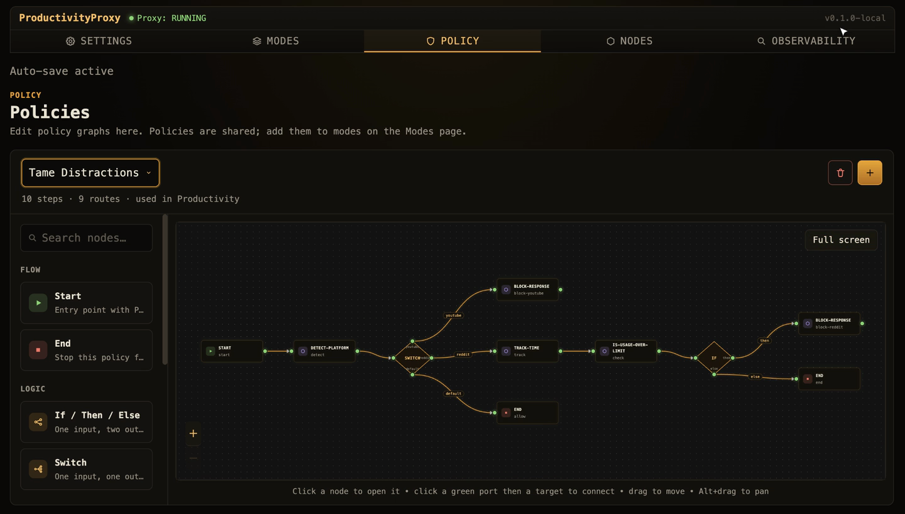
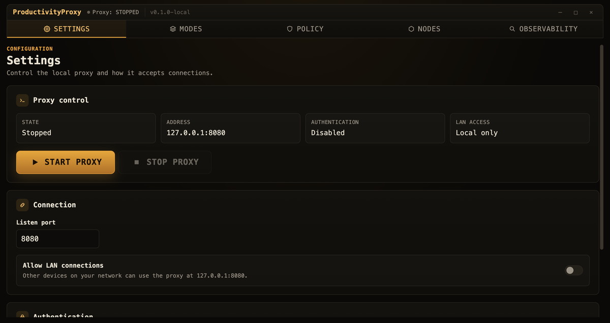
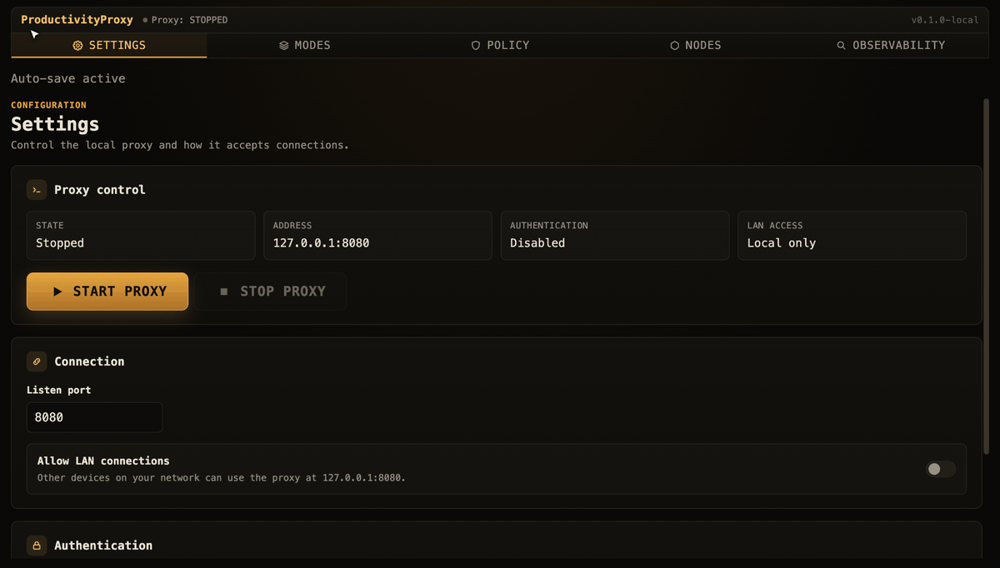
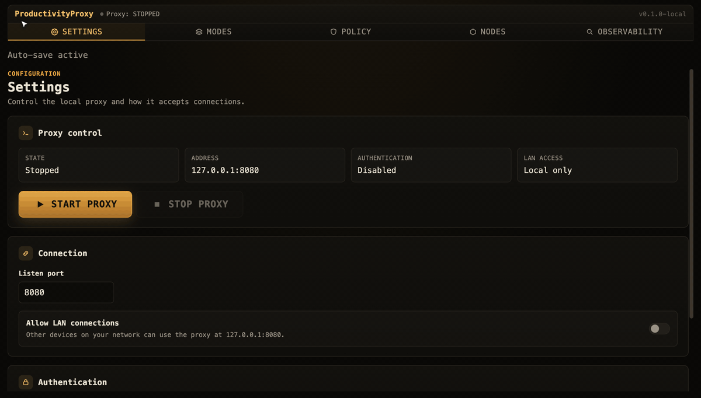
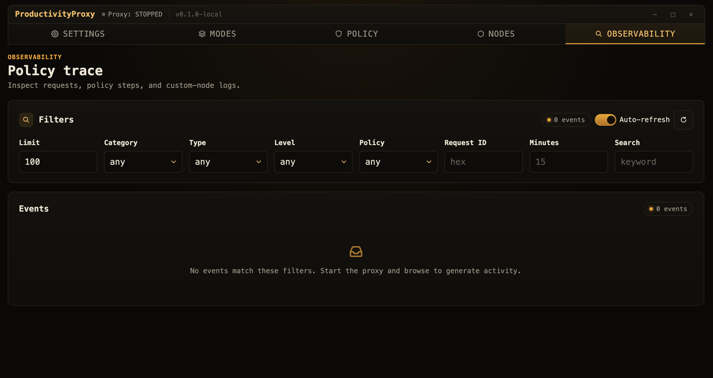

<div align="center">

# ProductivityProxy

**Focus on what you want (... or need) with a click.**

[](https://github.com/Vaccarini-Lorenzo/ProductivityProxy/actions/workflows/tests.yml)
[](https://github.com/Vaccarini-Lorenzo/ProductivityProxy/actions/workflows/benchmark.yml)

<a href="assets/hero.mp4"></a>

<sub>Simple demo showcasing two custom rules: Youtube shorts block and freedium redirect (we can do much more...)</sub>


</div>

---

ProductivityProxy runs a small proxy on your machine and lets you decides what to do with every request you makes. </br>
You draw the rules as graphs: a starting condition, some logic, and an action like block or redirect. Every node in a graph is a Python file: You can describe exactly what you want, tweaking requests and responses as you wish.

It lives in the macOS menu bar. Nothing leaves your machine. No account, no subscriptions, nothing at all.

## Why it exists

Made by an ADHD kid for ~~ADHD kids~~ himself.</br>
This is currently a personal-use project that I make publicly available hoping that it might be usefult to someone (and that someone more skilled and with more free time than me might actually make it good).

Most blockers are a browser extension (ew), or a paid app wrapping a fixed list of domains. This one is built differently: It lets you customize your policies completely, bundle them into modes, tweak responses (possibly injecting custom components in the webpage) and embed custom logic as you wish.

## But can't I do the same exact thing with mitmproxy addons?

Yes, but would you be able to throw around boxes and connect them? No? Exactly my point.
> Spoiler: Under the hood mitmproxy addons are used

## What it does

- **Visual policies.** Build start, logic, and action graphs on a canvas instead of editing config by hand.
- **Python underneath.** Every node is a small Python file with access to the request. Read the URL, rewrite it, block it, or compute whatever you like.
- **Modes.** Group policies into modes like **Deep Work**, **ADHD Block** or **Chill**, and switch between them in one click.
- **A readable event log.** See which policy fired on which request, and why.
- **Local and private.** A macOS menu bar app driving mitmproxy. Your traffic stays on the machine.

## Components

```text
active mode
   policy 1      checked first
   policy 2
   policy 3
   ...

each policy is a small graph:
   start  >  logic  >  action (block, redirect, ...)  >  end
```

- A **mode** is an ordered list of policies. Only the active mode runs.
- A **policy** is a graph that begins at a **Start** node. The Start node holds a Python `triggered_by(request) -> bool`. If it returns `False`, the policy is skipped.
- Policies run from top to bottom and the first one that produces a response wins, usually a block. If none respond, the request passes through untouched.
- An empty mode allows everything. Chill is just a mode with no policies.

Just as examples, the project includes some built-in pythin nodes *(custom logic)* and operators *(control flow management)*:

| Block | Kind | What it does |
|------|------|--------------|
| **If / Then / Else** | operator | One input, two branches (Python `if_condition`) |
| **Switch** | operator | One branch per case (Python `switch_condition`) |
| **Start** | flow | Entry point plus a Python trigger (`triggered_by`) |
| **End** | flow | Stops the policy |
| **Block Response** | node | Returns a `403` (or any status) with a message |
| **Track Time** | node | Accumulates active time on a platform |
| **Is Usage Over Limit** | node | Flags when a daily budget is exceeded |
| your own | node | Any Python file with a `run(input, request, context, params)` function |

## Dashboard - Settings

- Start and stop the proxy
- Pick the port
- Allow other devices on your network to connect to your proxy
- Turn on auth if you want it.



## Dashboard - Modes
Sets of policies you switch between.

Only the active mode runs.


## Dashboard - Policies
The visual editor.

Drag operators and nodes from the library onto the canvas to define how a request/response is handled.



## Dashboard - Nodes
Your library of reusable Python blocks.

Each node is a middleware you can run in a policy.



## Dashboard - Observability
A filterable trace of every request, every policy step, and anything your nodes log.



## What you can build

The default library ships `Block Response`, `Track Time`, and `Is Usage Over Limit`. Most of the ideas below are a small custom node away, which is the whole point: the interesting rules are a few lines of Python.

| What you want | How you would build it |
|------|-----------------|
| **Kill YouTube Shorts** | `Start` (matches `youtube.com` and `/shorts`) goes to `Block Response 403`. Ships by default. |
| **Daily Reddit budget** | `Start` (matches `reddit.com`) goes to `Track Time`, then `Is Usage Over Limit (30 min)`, then `If over`, then `Block`. Ships by default. |
| **Inject a video summary** | On a YouTube watch page, inject an iframe with an LLM summary built from the video's transcript, right next to the player. |
| **No social, ever** | `Start` (matches your social hosts) goes to `Block Response` with a "back to work" page. |
| **No work links after a set hour** | `Start` checks the host and the time of day, then blocks or redirects so the evening stays yours. |
| **Stay on topic with an LLM** | A node that scores each request against today's topic, using embeddings or an LLM, and filters out the content that drifts off it. |
| **Skip the paywall** | `Start` matches article URLs and redirects to a reader like Freedium when the URL pattern fits. |
| **Nudge instead of block** | A notify node: `Start` (matches news sites) goes to `Notify` ("fifth time on the news today"), then `End`, and lets it through. |
| **Redirect to a focus page** | `Start` (matches distraction hosts) redirects to your own "is this what I planned to do?" page. |
| **Per platform limits** | A detector node feeds a `Switch` on platform (youtube, reddit, twitter), with a different budget per case. |

## Custom nodes

A node is a Python file that exposes `run(input, request, context, params)`.

It gets the value from the previous node, the current request, a small helper `context`, and its configured `params`. Return the value for the next node, or call `request.block(...)` or `request.redirect(...)` to act on the request directly.

```python
# block_response.py: return a 403 with a custom message
from typing import Any

from proxy.api import Context, Request


def run(input: Any, request: Request, context: Context, params: dict[str, Any]) -> Any:
    request.block(int(params["status"]), str(params["message"]))
    return input
```

Add the file on the **Nodes** page, then drag it into any policy from the library. That is the whole extension model.

> Custom nodes and inline trigger or operator Python run with your permissions and full mitmproxy access. They are not sandboxed, so only run code you trust.

## Requirements

> ProductivityProxy is built on top of [mitmproxy](https://mitmproxy.org/). You install mitmproxy and trust its certificate. The app does not bundle it.

- **macOS** for automatic proxy control. The app snapshots your system HTTP and HTTPS proxy settings on start and restores them on exit. On Linux you can still run the proxy by hand and point your browser at it.
- **mitmproxy** on your `PATH`:
  ```bash
  brew install mitmproxy
  ```
- **The mitmproxy CA certificate, trusted**, so it can read HTTPS. After the first `mitmdump` run it lives at:
  ```text
  ~/.mitmproxy/mitmproxy-ca-cert.pem
  ```
  Trust it on every device you proxy (macOS Keychain, or your browser or OS trust store). Without it, HTTPS sites cannot be inspected or blocked.
- **Rust, Node.js, and npm** to build and run the desktop app.
- **These environment variables.** The app refuses to start the proxy without them:

  | Variable | Purpose |
  |---|---|
  | `POLICY_MAX_STEPS` | Hard cap on policy steps per request, as a loop guard. |
  | `PRODUCTIVE_PROXY_TELEMETRY_VERBOSE` | `true` adds the full per step policy trace to events. |
  | `PRODUCTIVE_PROXY_EVENT_LOG_MAX_BYTES` | Event log size budget before old events are compacted. |
  | `PRODUCTIVE_PROXY_STATE_FLUSH_SECONDS` | How often usage state is written to disk. |

## Quick start

```bash
# 1. Prerequisite (see Requirements above)
brew install mitmproxy

# 2. Run the desktop app (Rust, Node, and npm required)
export POLICY_MAX_STEPS="1000"
export PRODUCTIVE_PROXY_TELEMETRY_VERBOSE="false"
export PRODUCTIVE_PROXY_EVENT_LOG_MAX_BYTES="5000000"
export PRODUCTIVE_PROXY_STATE_FLUSH_SECONDS="2"
cd src/frontend/react
npm install
npm run tauri dev
```

The window starts hidden. Open it from the tray icon in the menu bar.

To enforce rules on HTTPS traffic, install and trust the mitmproxy CA certificate (`~/.mitmproxy/mitmproxy-ca-cert.pem` after the first run).

**Run the proxy without the app** (configure your browser to use the listener manually):

```bash
set -a; source .env.example; set +a
./scripts/run_mitm.sh
```

## Project layout

```text
src/
  frontend/
    react/        React dashboard (Vite)
    tauri/        Tauri v2 Rust shell and native commands
  proxy/          Python mitmproxy policy engine
scripts/          dev helper scripts
test/             unit and integration tests
docs/             design and architecture docs
```

## Tests

```bash
# Python engine
POLICY_MAX_STEPS=1000 python3 -m unittest discover -s test -t . -p 'test_*.py'

# React app
cd src/frontend/react && npm test && npm run build

# Rust / Tauri backend
cd src/frontend/tauri && cargo test
```

## Benchmark

A repeatable benchmark for the hot path. It measures per request latency, telemetry volume, and the cost of reading observability:

```bash
set -a; source .env.example; set +a
./scripts/run_bench.sh                      # BENCH_N_TRACK=50000 ./scripts/run_bench.sh to scale
```

## Docs

- [docs/usage.md](docs/usage.md): running and using the app
- [docs/development.md](docs/development.md): setup, tests, workflows
- [docs/architecture/](docs/architecture/): component and data layer design
- [docs/architecture/2_component/python-proxy-engine.md](docs/architecture/2_component/python-proxy-engine.md): the node execution contract

## Current limitations and TODOs

- **macOS first.** Starting the app snapshots and restores macOS system proxy settings. Linux proxy automation is not built yet, so run the proxy by hand there.
- **HTTPS needs the mitmproxy CA** installed and trusted on each client.
- **Custom Python nodes are not sandboxed.** They run with your permissions.
- **mitmproxy is not bundled.** Install it with Homebrew.
- If the app is force killed, macOS proxy settings may need a manual reset. See [docs/usage.md](docs/usage.md#recovery-if-macos-proxy-stays-enabled).
